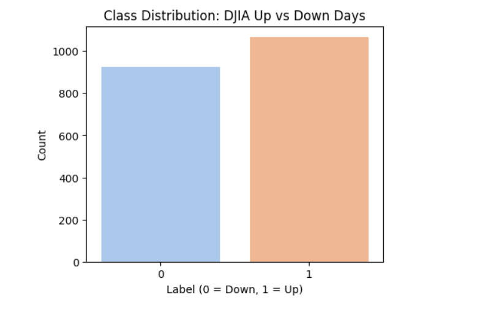
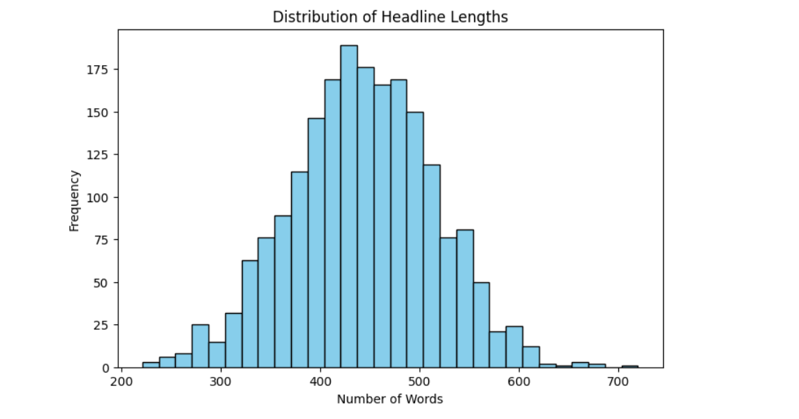
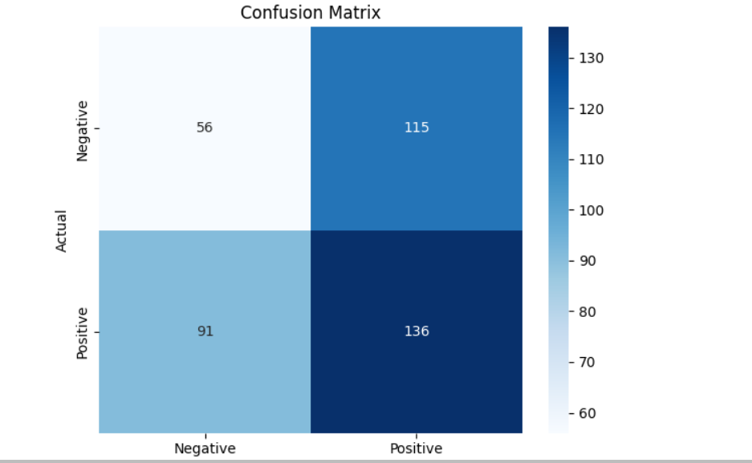
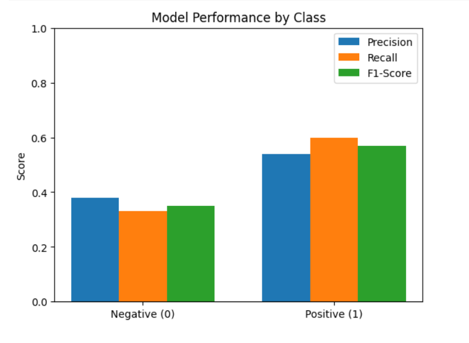

# SentimentPulse: Predicting Stock Movement Using Social Media Sentiment

This project explores whether social media sentiment collected from platforms like Twitter and Reddit can help predict short-term stock price movements. By combining sentiment data with historical stock price data, we aim to train machine learning models that classify sentiment and forecast price direction.

## 🔍 Project Goals

- Collect and preprocess social media text data.
- Perform sentiment classification using NLP techniques.
- Merge sentiment with historical stock price data.
- Build and compare machine learning models (e.g., Logistic Regression, SVM).
- Visualize trends and evaluate model performance.

## 🧠 Technologies Used

- Python
- Pandas, NumPy
- Scikit-learn
- NLTK
- Matplotlib / Seaborn
- Jupyter Notebook

## 📁 Project Structure

SentimentPulse/
│
├── data/ # Raw and cleaned datasets
├── notebooks/ # Jupyter notebooks for exploration and modeling
├── visuals/ # Plots and model evaluation charts
├── README.md # Project overview and instructions
├── requirements.txt # List of dependencies
└── .venv/ # Python virtual environment (activated)

## 📦 Installation & Setup

To set up this project on your local machine:

1. Clone the repository:
   ```bash
   git clone https://github.com/don4ye/SentimentPulse.git
   cd SentimentPulse

2. Create and activate a virtual environment:
python -m venv .venv
source .venv/bin/activate   # On Windows use: .venv\Scripts\activate

3. Install dependencies:
pip install -r requirements.txt

## 🧪 Running the Notebooks

To run the analysis and modeling steps:

1. Navigate to the `notebooks/` directory.
2. Open the main notebook (e.g., `Sentiment_Analysis_Project.ipynb`) using Jupyter Notebook or VS Code.
3. Run the cells step by step to:

   - Load and explore the dataset
   - Preprocess and clean the text data
   - Extract features using TF-IDF
   - Train and evaluate the Logistic Regression model
   - Visualize the performance using charts and metrics

   ## 📊 Results & Visualizations

This section showcases key visuals generated during the analysis of DJIA stock movement prediction using sentiment from news headlines. These helped interpret model performance and the nature of the dataset.

### 🧠 Word Cloud of Most Frequent Words
This word cloud visualizes the most frequently occurring and sentiment relevant words across all combined financial news headlines. Prominent terms such as “government,” “new,” “world,” “people,” “country,” and “attack” indicate recurring topics related to global affairs, geopolitical conflicts, and leadership decisions. These themes often carry emotional weight and are influential in shaping investor sentiment, making them critical to understanding potential stock market movements.


### 📈 Class Distribution (Up vs Down Days)
This bar chart displays the distribution of market up days (1) vs down days (0), showing a relatively balanced dataset.


### 📊 Distribution of Headline Lengths
The histogram below shows the distribution of the total headline lengths (combined headlines per day), helping us understand the text input size.


### 🔍 Confusion Matrix
This confusion matrix visualizes the model’s performance in terms of true positives, false positives, true negatives, and false negatives.


### 📊 Model Performance by Class
This grouped bar chart displays precision, recall, and F1-score for each class, showing that the model performed better on predicting up days (1).



## ✅ Results Summary

- The Logistic Regression model achieved an accuracy of **48.24%**.
- **Class 1 (Positive Sentiment)** had better precision and recall than **Class 0 (Negative Sentiment)**.
- The model frequently misclassified negative sentiment as positive.
- Visualizations like the confusion matrix and classification report charts confirmed these findings.

While the results were modest, they highlight important challenges in sentiment classification using simple models and underscore the need for richer features or more advanced techniques.

## Limitations

- The dataset is limited to news from 2008–2016 and may not generalize to today's market behavior.
- The TF-IDF method may not fully capture the context and semantics in the headlines.
- Logistic Regression may be too simple for capturing the complexity of sentiment-driven market movement.


## 🔮 Future Work

To improve model performance and expand the project’s scope, the following steps are recommended:

- **Use Advanced Models**: Explore models like Random Forest, Gradient Boosting, or deep learning models such as LSTM and BERT.
- **Enhance Feature Engineering**: Incorporate word embeddings (e.g., Word2Vec, GloVe) for richer text representation.
- **Data Balancing**: Apply techniques like SMOTE or undersampling to handle class imbalance.
- **Time-Series Integration**: Merge sentiment data with real-time stock price data for a more dynamic prediction model.
- **Deploy as a Web App**: Build a dashboard or lightweight app to visualize live sentiment trends.

These enhancements can increase predictive accuracy and help apply the solution to real-world trading or market monitoring scenarios.

## 🙋‍♂️ Author

**monsuru Adebisi**  
- 📧 Email: adedayo76431@gmail.com  
- 🔗 GitHub: [don4ye](https://github.com/don4ye)  
-    [Overleaf Project Report (PDF)](https://www.overleaf.com/read/knfykzwnrzyw#4d55bd)
- 📍 Location: Kenner, Louisiana  
- 🎓 Data Analytics Graduate Student, Northwest Missouri State University (2025)


## 📄 License

This project is licensed under the [MIT License](LICENSE). You are free to use, modify, and share this project with attribution.
